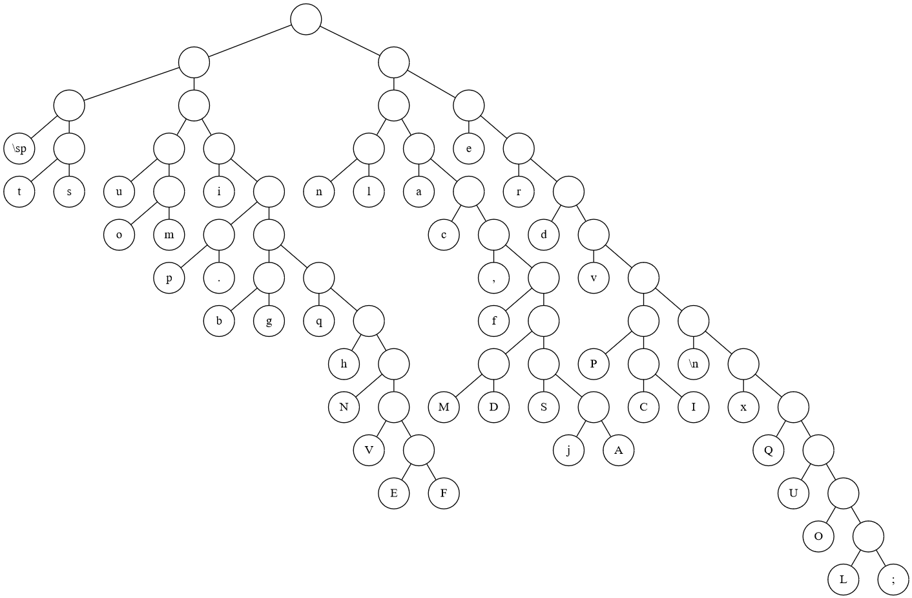
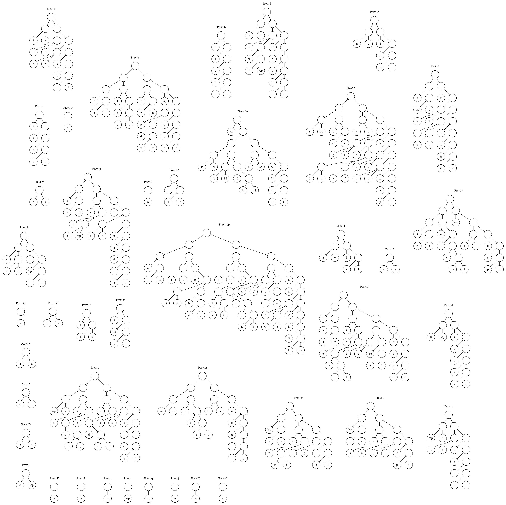

# Markov-Huffman Coding


Welcome to a data compression project. This project is a proof of concept that applies conditional
probability to Huffman coding, creating a data compression system which takes better advantage of
patterns in data than traditional Huffman coding.

### TL;DR: Results

Markov-Huffman coding offers a 20-30% improvement over traditional Huffman coding. There are some
(niche) cases where Markov-Huffman coding works really well standalone and there may applications of
this idea in conjunction with other compression techniques. Many widely used compression utilities
such as gzip, bzip2, and DEFLATE, use traditional Huffman coding under the hood in conjunction with
other algorithms.

### Table of Contents
- [Encoding Details](#encoding-details)
- [Usage](#usage)
- [Performance](#performance)
- [Overhead](#overhead)
- [Order-3 Markov Chains](#order-3-markov-chains)
- [Results and Applications](#results-and-applications)
- [Existing work](#existing-work)
- [Logistics](#logistics)

## Encoding Details

Huffman coding is a data compression technique that uses variable-length codes to losslessly
compress data. By assigning short codewords to the most frequently used symbols and longer codewords
to more uncommon symbols, huffman coding creates a more compact representation for a given data set.
Even in a codec where symbols have a uniform frequency, Huffman coding can still save on space if
the set of used symbols is smaller than the number of representable symbols in the codec's
fixed-length coding.

Here are a couple small examples with an alphabet `{a, b, c, d}` and a default 2-bits-per-character
fixed-length encoding.

```
source: aaaabbc
  7
 / \
a   3
   / \
  b   c
Fixed-length encoding: 00000000010110 (14 bits)
Huffman coding:        0000101011     (10 bits)
```

Four bits are saved. There are some situations where huffman coding may not be able do do anything,
though. Another example with the same alphabet and encoding:

```
source: abcdabcd
      8
  +---+---+
  4       4
 / \     / \
a   b   c   d
Fixed-length encoding: 0001101100011011 (16 bits)
Huffman coding:        0001101100011011 (16 bits)
```

Because every character in the alphabet is used with the same frequency and every symbol in the
alphabet is used, huffman coding is not able to do anything here. The huffman coding and
fixed-length encodings are identical.

But there's an obvious pattern here: `abcd` is just repeated twice. Every `a` is followed by `b`,
every `b` by `c`, and so on. Applying a Markov model to our input data will allow us to take
advantage of more patterns in the input data than traditional Huffman coding does.

```
source: abcdabcd
prev: ' ' prev: a prev: b prev: c prev: d
     1        2       2       2       1
    /        /       /       /       /
   a        b       c       d       a
Fixed-length encoding: 0001101100011011 (16 bits)
Markov-Huffman coding: 00000000         (8 bits)
```

Eight bits saved. This is the encoding system developed in this project. The Markov model can be
helpful for better encoding data where there is inter-symbol dependence, such as human language.

### Huffman Trees

Traditional Huffman coding tree from 150 paragraphs of Lorem Ipsum placeholder text:



Markov-Huffman coding trees from 150 paragraphs of Lorem Ipsum placeholder text:



## Usage

This repo contains a simple compression/decompression utility which utilizes Markov-Huffman coding.

```
markov-huffman <input> [-o output] [options]
    -o output_file
    -h use simple huffman coding

    -e encoding_file
    -d output_encoding_file

    -g print huffman trees and tables
    -x extract
```

If no output file is provided, the program will compress/decompress to `stdout`. Markov-Huffman
encoding relies on encoding table files. Use `-d` to generate and create an encoding table, and `-e`
to load an existing table.

`-g` will print all huffman encoding tables as well as all huffman trees in dot/graphviz format.

### Example:

```bash
# compress
markov-huffman document.txt -o compressed -d encoding
# extract
markov-huffman compressed -e encoding 2>/dev/null | tee decompressed.txt
```

## Performance

This project is a proof of concept. There is room for performance improvement in the implementation
of this algorithm, however, this project is pretty good.

Lookup tables are often used to speedup the Huffman decoding process. 8-bit or 16-bit lookup tables
would be feasible memory wise (though 16-bit lookup tables would be very memory intensive in the
Markov-Huffman system), however we need a way of handling codewords longer than the table key size.
In this project I've implemented 8-bit lookup tables which should provide a good balance between
memory, complexity, and speedup. The vast majority of codewords are <= 8 bits long, and the lookup
table enables these codewords to be decoded in one step. For the rare codewords longer than 8 bits,
the decoder falls back on tree traversal and the lookup table is able to skip past 8 levels of the
tree.

## Overhead

One of the obstacles with this compression technique is that specialized encoding trees must be
stored in order to decompress the data later. While a single Huffman tree can be stored very
compactly, Markov-Huffman coding requires up to 256 huffman trees to be stored. For some data sets,
this may be quite substantial.

This project makes an effort to store Huffman trees are stored compactly, however, there is still
room for improvement. One way to improve the storage of Huffman trees would be to use canonical
Huffman codes, which I have not implemented for this proof of concept.

The good thing about the overhead associated with Markov-Huffman coding is that it is constant.
Unless tables are updated throughout the compression of a file, the overhead will become negligible
as the input is larger.

This overhead can be circumvented, too, by constructing general-use Huffman tables stored in a
shared manner instead of generating special Huffman tables tailored for each incoming file.

## Order-3 Markov Chains

Can compression be further improved with higher-order markov chains? Probably. I haven't explored
them in this project, though. The main downsides I can think of are overhead, memory requirements
run the algorithm, and degraded cache performance.

It would be interesting to explore using a limited number of order-3 markov chains where the benefit
outweighs the cost, however, I'll have to put that on the backlog.

## Results and Applications

```
+---------------------+---------+----------------+
| Test file           | Huffman | Markov-Huffman |
+---------------------+---------+----------------+
| input_ipsum.txt     | 0.53    | 0.42 (-22%)    |
| input_wiki_cpp.txt  | 0.65    | 0.48 (-26%)    |
| input_wiki_cpp.html | 0.68    | 0.47 (-31%)    |
| markovhuffman.exe   | 0.71    | 0.51 (-28%)    |
+---------------------+---------+----------------+
```

**Conclusion:** Markov-Huffman offers a 20-30% improvement upon traditional Huffman coding,

I am happy with how well this technique performed. Markov-Huffman coding offers significant
improvement over traditional Huffman coding at reasonable constant overhead.

Other widely used compression utilities such as gzip, bzip2, and DEFLATE, use traditional Huffman
coding under the hood in conjunction with other algorithms. I am interested to see whether Markov-
Huffman coding offers any improvement over other compression utilities when used in conjunction with
other algorithms.

Standalone, Markov-Huffman coding has applications. Traditional Huffman coding is sometimes used
standalone because it's fast and offers a reasonable amount of compression. Markov-Huffman coding is
just as fast\* and can only improve upon traditional-Huffman coding.

\* Theoretically just as fast, however, Markov-Huffman coding may introduce more cache misses and
uses more memory to run the algorithm. The bottleneck is, nonetheless, expected to lie in the hard
disk.

I previously applied huffman coding to [compressing digits of pi][sc]. Using a fixed Huffman
encoding table, I was able to achieve a compression ratio of `0.425`, better than any other
compression utility tested, and the program I wrote was also faster than any other compression
utility tested. Granted, this is a niche case: tiny alphabet compared to symbol capacity of the
default fixed-length encoding (ascii). One pesky problem with compressing the digits of pi is that
the decimal character after the leading `3` only appears once ever but takes up space in the
encoding tree. Including the decimal place symbol in the encoding tree would have lead to a
compression ratio of `0.438`, which may not sound like much of a difference, but this difference is
from a single character among billions of digits. Previously, I added a special case to just ignore
that decimal place. But, because the single decimal place only occurs after a `'3'`, applying
Markov-Huffman coding to the pi problem leads to an compression ratio of `0.426`; nearly identical
to the compression ratio and without special handling for the decimal place.

## Existing work

Unsurprisingly, this idea isn't entirely original. I've found a paper from 1985, [Markov-Huffman
coding of LPC parameters][1], and a stackoverflow post from 2018, [Huffman Coding for Markov Chain
based on conditional distribution][2], which describe similar ideas. Both of these discuss taking
advantage of conditional probabilities with huffman coding in the context of engineering problems.

Another [post][3] on cs stackexchange regarding data stream compression briefly mentions that "...
if there are correlations between neighboring symbols (which there are in real human produced text)
you can do better by choosing codes for pairs of letters." I think the system I've developed here
should provide more optimal compression, however, I can't find any examples of this 2-char symbol
huffman encoding strategy to compare against.

Update: After making this I learned that bzip2 uses multiple huffman tables internally. The
difference is that bzip2 selects the optimal tree every 50 symbols (source: wiki).

### Encryption

Because this encoding algorithm creates a binary blob that is only meaningful in conjunction with an
encoding tree file, there could be application of this idea in the context of encryption (with
randomized trees as opposed to frequency-based Huffman trees). In their paper [On the security of
multiple Huffman table based encryption][4], Zhou et al. explore the security of a multi-Huffman
encryption technique and conclude that the technique is not secure.They use a tree mutation
algorithm on Huffman trees which "have good compression ratio\[s\]". Despite using frequency-based
Huffman trees initially, I think the attacks described in this paper would still work on randomized
trees.

## Logistics

This project is Copyright (c) Jeremy Rifkin 2021.

This repository contains Wikipedia source-code and article contents, used as test cases for
algorithm correctness and efficiency and located in `test/input/`, which are licensed under the
[`CC BY-SA 3.0 License`][CC].

[1]: https://ieeexplore.ieee.org/document/1164545
[2]: https://stackoverflow.com/q/49955585/6529874
[3]: https://cs.stackexchange.com/a/14161/57552
[4]: https://www.sciencedirect.com/science/article/pii/S1047320310001434
[sc]: https://github.com/jeremy-rifkin/strawberry-cheesecake
[CC]: https://en.wikipedia.org/wiki/Wikipedia:Text_of_Creative_Commons_Attribution-ShareAlike_3.0_Unported_License
